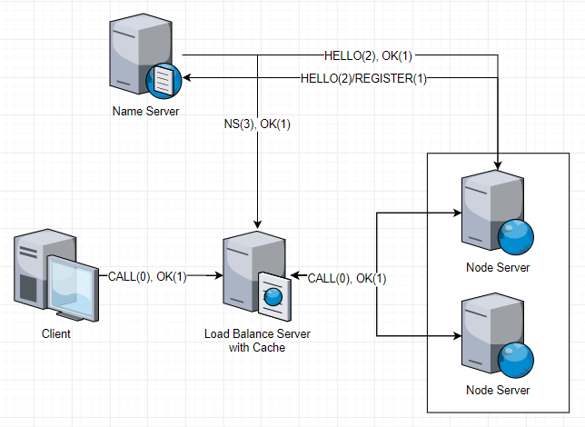

# jgRPC.go

:cyclone: Toy RPC from 0 to 0.01

The North-West window is `Client.go`, the North-East one is `LdBlsServer.go`, the Sourth-West and the Sourth-East windows are `NodeServer.go` and the Central one is `NameServer.go`.

It's clear that our simple `Load Balance Server` and `Name Server` does work.

(From the second window, Node1 and Node2 seems out-off-balance for the number of Node Servers is still too small when it comes to using `CONSIST-HASH` as the algothrim of `Load Balance`.)

## Target

* [x] Self-Defined RPC Protocol; (Non-Standard)
* [x] Protocol Analysis, Serializable/Deserializable; (Simple)
* [x] Procedure Parameters Analysis, using Reflect; (Simple, Need polished)
* [x] Load Balance; (Consist Hash)
* [x] Service Register Center; (Simple)
* [x] Service Discovery; (Simple)
* [ ] Cache in Client; (Non-Standard)
* [ ] Health Probe; (Non-Standard)

## Now

